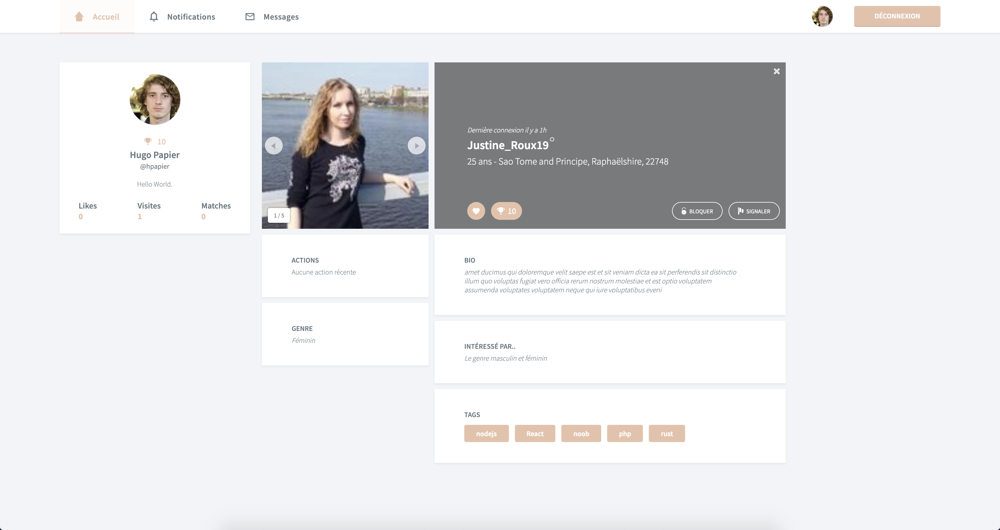
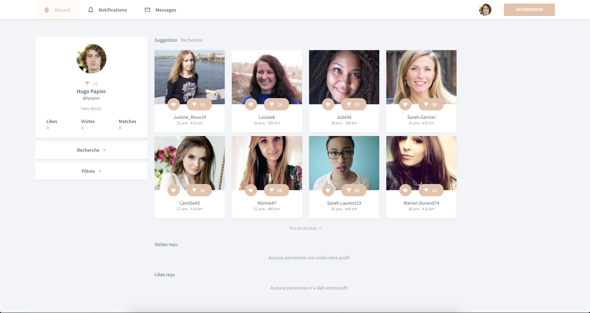
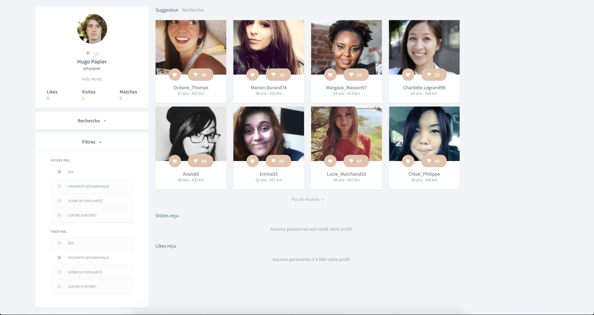
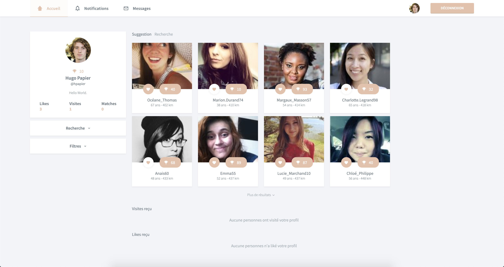

# Matcha
This project proposes to create a web application that allows the user to match/find a partner and chat with it.

This is a project realised alone during my studies at 'Ecole 42'.
I have designed and realised this project from scratch using ReactJs, Graphql, Apollo, Nodejs, PostgreSql, Websockets (Graphql-Subscription), HTML, SCSS (compiled CSS), Docker.

We have done everything from scratch with a responsive web design (HTML/CSS).

A fake data are generate with https://randomuser.me/api/ and Faker library.

## Features

### Profile
- Create an account (with email validation).
- Modified your private data.
- Watch the public profile of other people.

### Match
- Get a list of suggestion by preferences.
- Make a personnalized search.
- Filter all suggestion list/search list.
- Like/unlike people.
- See your action history.

### Notifications
- See all notifications about your match/unmatch, like, ..

### Chat
- Chat with your matched partners.

